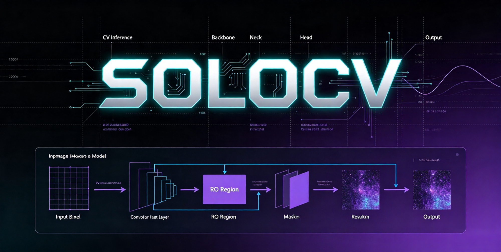

# 🚀 SOLOCV

觉得有用就给个 Star ⭐ 吧！


> 本项目致力于打造一个部署 CV 模型的简单工具，包含多种硬件推理后端。

> 独立、轻量、即拿即用的 CV 模型推理文件集 —— 每个模型一个文件，拿来就能跑。


[](LICENSE)
[](https://www.python.org/)
[](CONTRIBUTING.md)

---

## 📖 这是什么？

**SOLOCV** 不是一个框架，而是一个**CV 模型推理文件的集合**。

> 每个模型单独一个 `.py` 文件，下载下来就能用，不需要学习任何框架 API。

你只需要：
1. 找到你需要的模型文件（如 `yolo.py`）
2. 下载它
3. 运行它

就这么简单。

---

## ✨ 核心理念

| 传统框架 | SOLOCV |
|:---|:---|
| 需要安装整个框架 | 只下载你需要的那个文件 |
| 需要学习复杂的 API | 打开文件看一眼就懂 |
| 改一个地方可能影响全局 | 模型之间完全隔离 |
| 新手劝退 | 零门槛 |
|||


**SOLOCV 的目标：让你 10 秒内从下载到跑通第一个模型。**

---


> 每个文件都是**完全独立**的，你可以只下载 `yolo.py` 和对应的模型权重，其他什么都不需要。

---

## 🔧 怎么用？

### 一：下载模型权重（ModelScope）

模型权重已托管在 ModelScope，可按需任选一种方式下载：

**① 网页直接下载**

访问 [modelscope.cn/models/whiteCV/models/files](https://modelscope.cn/models/whiteCV/models/files)，按 `models/<任务>/<模型名>.onnx` 目录结构下载对应权重，放入项目的 `models/` 目录。

**② Git 下载**

```bash
git clone https://www.modelscope.cn/whiteCV/models.git
```

**③ pip install modelscope 命令行下载**

```bash
pip install modelscope
modelscope download --model whiteCV/models
```

> 下载完成后，将权重文件放到项目 `models/` 目录下（如 `models/det/yolo.onnx`），再参考各 `infer/*/README.md` 中的模型文件路径运行对应推理脚本。


### 二：直接运行命令行

```bash
# 下载 yolo.py 和模型权重后，如果在项目下执行，只需要执行命令即可，否则修改一下权重路径和文件路径
python yolo.py
```

## 📚 查看更多模型推理文档

- 🏷️ [查看分类任务模型推理文档](./infer/cls/README.md)
- 🎯 [查看目标检测模型推理文档](./infer/det/README.md)
- 🧩 [查看分割任务模型推理文档](./infer/seg/README.md)
- 🧍 [查看人体姿态模型推理文档](./infer/pose/README.md)
- 🔤 [查看OCR识别模型推理文档](./infer/ocr/README.md)
- 🛣️ [查看深度估计模型推理文档](./infer/depth/README.md)
## 🧠 已支持的模型列表

| 🏷️ 分类 (Classification) | 🎯 目标检测 (Detection) | 🧩 分割 (Segmentation) | 🧍 人体姿态 (Pose) | 🔤 OCR识别 (OCR) | 🛣️ 深度估计 (Depth) |
|:---|:---|:---|:---|:---|:---|
| ShuffleNetV2 | YOLO | YOLO-Seg | YOLO-Pose | - | Lite-Mono |
| | RTMDet | | RTMPose | | |
| | RT-DETR | | HRNet | | |
| | RT-DETRv2 | | ViTPose | | |

> 💡 更多模型持续更新中，可查看上方各任务类别对应的推理文档了解详情。


## 📄 许可证
采用 Apache License 2.0，商业友好，可自由使用和修改。


## 🙏 致谢
ONNX Runtime
所有开源模型和数据集
每一位贡献者 ❤️

## 📬 参与贡献
提 Issue 报告问题或建议
提 PR 添加新的模型文件
